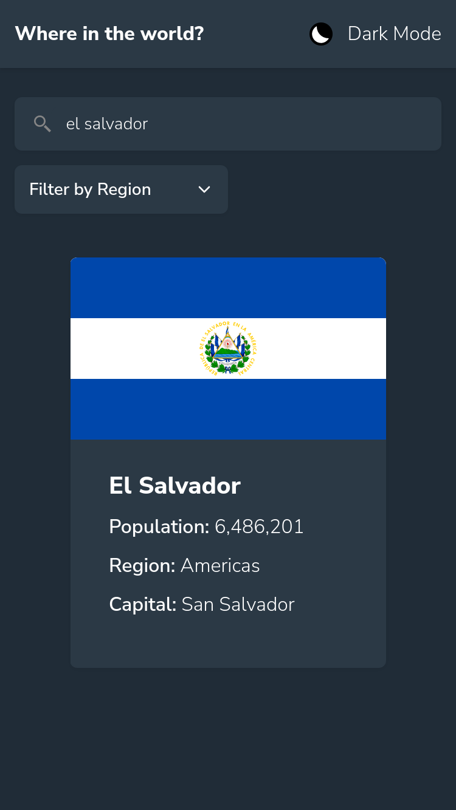

# Frontend Mentor - REST Countries API with color theme switcher solution

This is a solution to the [REST Countries API with color theme switcher challenge on Frontend Mentor](https://www.frontendmentor.io/challenges/rest-countries-api-with-color-theme-switcher-5cacc469fec04111f7b848ca). Frontend Mentor challenges help you improve your coding skills by building realistic projects.

## Table of contents

- [Overview](#overview)
  - [The challenge](#the-challenge)
  - [Screenshot](#screenshot)
  - [Links](#links)
- [My process](#my-process)
  - [Built with](#built-with)
  - [What I learned](#what-i-learned)
  - [Continued development](#continued-development)
  - [Useful resources](#useful-resources)
- [Author](#author)

**Note: Delete this note and update the table of contents based on what sections you keep.**

## Overview

### The challenge

Users should be able to:

- See all countries from the API on the homepage
- Search for a country using an `input` field
- Filter countries by region
- Click on a country to see more detailed information on a separate page
- Click through to the border countries on the detail page
- Toggle the color scheme between light and dark mode _(optional)_

### Screenshot



### Links

- Solution URL: [Add solution URL here](https://github.com/TheMcnafaha/fe-rest-country)
- Live Site URL: [Add live site URL here](https://fe-rest-country.vercel.app/)

## My process

### Built with

- Semantic HTML5 markup
- CSS Flexbox
- CSS Grid
- Mobile-first workflow
- [Qwik](https://qwik.builder.io/) - JS framework
- [Tailwind](https://tailwindcss.com/) - CSS framework

### What I learned

This challenge tested my knowledge of Qwik City.

Wanting to do a MPA, I had to render all the countries the API gave me on the server before I sent any HTML to the client.
RouteLoaders makes this surprisingly easy by giving you a hook that returns your fetch response, solving the hardest part of this challenge.

I also learned that themes with MPAs need to have state so that your page-to-page navigation doesn't lose the user picked theme. This felt very "spaghetti" to do in Qwik
because you lose syntax higlighting here:

```js
if (
  window.matchMedia("(prefers-color-scheme: dark)").matches &&
  localStorage.getItem("theme") === undefined
) {
  document.documentElement.classList.add("dark");
  localStorage.setItem("theme", "dark");
} else {
  if (localStorage.getItem("theme") === "dark") {
    document.documentElement.classList.add("dark");
  } else {
    document.documentElement.classList.remove("dark");
  }
}
})();
window.addEventListener('load', function() {
        }
        );
};
```

I do like how Tailwind solves themes though; you just need to add a "dark" class and it will handle the rest.

### Continued development

My current solution SSRs everything but the images. This means that the user most render the images, so on slow connections they will see the default grey background. This is true despite the fact that
I use SVGs, which are text-friendly files. In theory, I could send the SVGs text to the client so that they don't need to eat the call to the CDN.

My current solution also has a suprising amount of blocking time. I'd like to drop that down, but I would need to find the cause of first.

### Useful resources

- [Qwik Documentation](https://qwik.builder.io/) - Their docs and built-in AI help saved me hours.
- [Tailwind Documentaion](https://tailwindcss.com/docs/installation) - Same idea as the one above, but styling. I needed to handle themes swithching, couldn't have done it without it.

## Author

- Frontend Mentor - @TheMcnafaha
